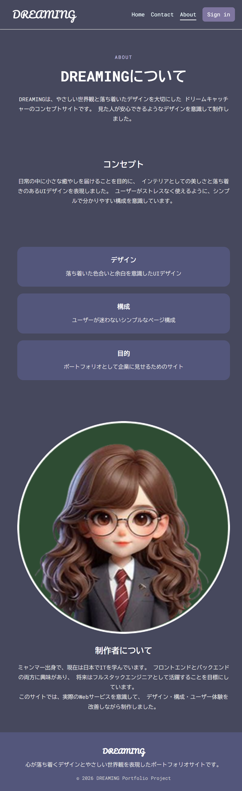
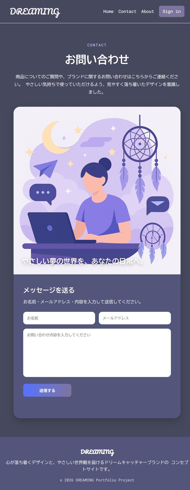

# 自己紹介

はじめまして、YOON EI PHYO（ヨン イ ピョー）と申します。  
ミャンマー出身で、現在は専門学校沖縄ビジネス外語学院でITを学んでいます。  

フロントエンドとバックエンドの両方に興味があり、  
将来はフルスタックエンジニアとして活躍したいと考えています。  

現在はWebアプリケーション開発を中心に学習しており、  
実践的なスキルを身につけるために日々努力しています。

---

## 技術スタック

### 💻 フロントエンド
- HTML / CSS
- JavaScript
- Next

### ⚙️ バックエンド
- JAVA
- PHP（基礎）

### 🗄 データベース
- MySQL

### 🛠 ツール
- Git / GitHub
- VS Code

### 📜 資格

- Java SE Bronze
- CompTIA Tech+
- 日本語能力試験 N2
- TOEIC 700

---

## 学習目標

- React（フロントエンド強化）
- Spring Boot
- Node.js / API開発
- データベース設計
- インフラ（AWS / Linux）

---

## プロジェクト

# 🌙 Dreaming Portfolio

## 🔗 Live Demo
[Dreaming Portfolio を見る](https://github.com/w25019/dreaming-portfolio)

## 📝 概要
ドリームキャッチャーをテーマにしたマルチページWebサイトです。  
落ち着いたデザインと使いやすいUI/UXを意識して制作しました。

## 🛠 技術スタック
- HTML / CSS / JavaScript

## 💡 主な機能
- レスポンシブ対応
- お問い合わせフォーム（入力チェック）
- ログインUI（パスワード表示切替・localStorage）
- モーダル表示（商品詳細）

## 🎯 工夫した点
- シンプルで直感的なナビゲーション設計
- 色と余白で「落ち着き」を表現
- JavaScriptでユーザー操作のフィードバックを強化

## 📸 Screenshots

<table>
  <tr>
    <td align="center"><b>Home Page</b></td>
    <td align="center"><b>About Page</b></td>
  </tr>
  <tr>
    <td valign="top" align="center" style="height:300px;">
      
    </td>
    <td valign="top" align="center" style="height:300px;">
      
    </td>
  </tr>
  <tr>
    <td align="center"><b>Contact Page</b></td>
    <td align="center"><b>Login Page</b></td>
  </tr>
  <tr>
    <td valign="top" align="center" style="height:300px;">
      
    </td>
    <td valign="top" align="center" style="height:300px;">
      
    </td>
  </tr>
</table>

# 🏦 Bank Management System

## 🔗 Project Link

[Bank Management System を見る](https://github.com/w25019/Bank)

## 📝 概要

Javaで開発したコンソールベースの銀行管理システムです。
口座作成、入金、出金、送金、口座情報表示などの基本的な銀行機能を実装しました。

## 🛠 技術スタック

* Java
* OOP（オブジェクト指向プログラミング）
* LinkedList
* BigDecimal

## 💡 主な機能

* 7桁の口座番号を自動生成
* 新規口座作成
* 入金 / 出金
* 口座間送金
* 口座情報表示
* システム終了機能

## 🎯 工夫した点

* 重複しない口座番号を自動生成
* BigDecimalを利用して金額計算の精度を向上
* OOPを意識してクラスごとに役割を分割
* メニュー形式で直感的に操作できるよう設計

## 📸 Screenshots

<table>
  <tr>
    <td align="center"><b>Opening New Account</b></td>
    <td align="center"><b>View Account Details</b></td>
  </tr>
  <tr>
    <td valign="top" align="center" style="height:300px;">
      
    </td>
    <td valign="top" align="center" style="height:300px;">
      
    </td>
  </tr>
  <tr>
    <td align="center"><b>Deposit</b></td>
    <td align="center"><b>Withdraw</b></td>
  </tr>
  <tr>
    <td valign="top" align="center" style="height:300px;">
      
    </td>
    <td valign="top" align="center" style="height:300px;">
      
    </td>
  </tr>
    <tr>
    <td align="center"><b>Tansfer</b></td>
    <td align="center"><b>Checking After Transferring</b></td>
  </tr>
  <tr>
    <td valign="top" align="center" style="height:300px;">
      
    </td>
    <td valign="top" align="center" style="height:300px;">
      
    </td>
  </tr>
    <tr>
    <td valign="top" align="center" style="height:300px;">
      
    </td>
     <td valign="top" align="center" style="height:300px;">
      
    </td>
  </tr>
</table>

---

## 連絡先

- Email: w25019@osfl.ac.jp
- GitHub: https://github.com/w25019
